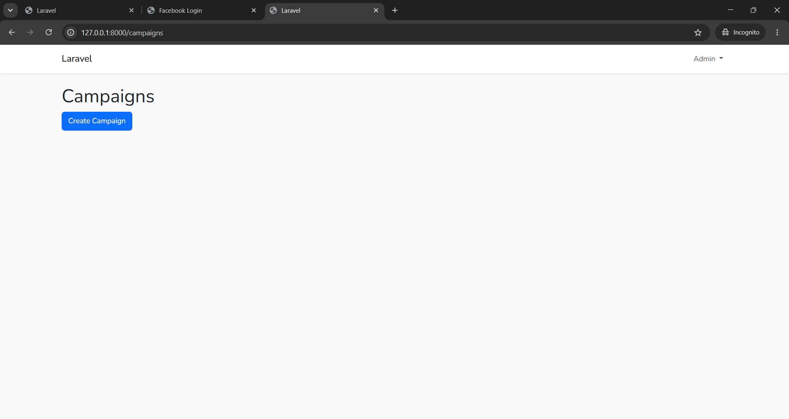
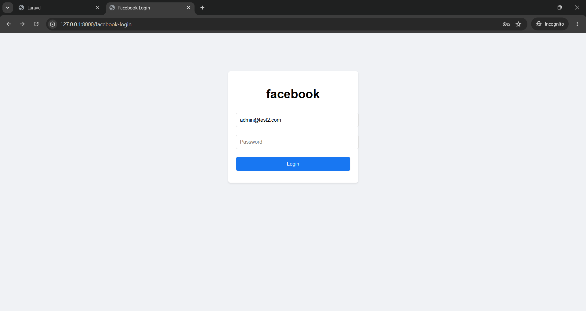

# Phishing Awareness Simulation

## Overview
This project is an open-source phishing simulation application designed for cybersecurity awareness training and educational purposes. It allows administrators to simulate phishing attacks in controlled, authorized environments to test, measure, and improve organizational security posture and employee awareness against social engineering threats.

## Features
- **User Authentication**: Secure login and registration for administrators to manage simulations.
- **Campaign Management (CRUD)**: Create, read, update, and delete phishing simulation campaigns (including subject line, target recipient email, email body, and the simulation link).
- **Email Sending via Mailtrap**: Securely route simulated phishing emails through Mailtrap SMTP server.
- **Fake Facebook Login Simulation**: A replica of the Facebook login interface to simulate credential harvesting.
- **Credential Logging**: Safely log simulated submissions (email, password, IP address, and user agent) for training analysis.
- **Redirect to Original Website**: Redirect targets to the official Facebook website immediately after credentials are submitted to mimic real-world phishing tactics.
- **Dashboard**: A comprehensive administrator panel that provides real-time statistics on email clicks and harvested credentials to evaluate awareness metrics.

## Technologies Used
- **Laravel 12**
- **PHP 8.2**
- **MySQL**
- **Blade**
- **Bootstrap**
- **Mailtrap SMTP**

## Installation
To set up the Phishing Awareness Simulation project locally, follow these steps:

1. Clone the repository:
   ```bash
   git clone https://github.com/shanmaurya1305/Phishing-Awareness-Simulation.git
   ```

2. Navigate to the project directory:
   ```bash
   cd Phishing-Awareness-Simulation
   ```

3. Install PHP dependencies:
   ```bash
   composer install
   ```

4. Install frontend dependencies:
   ```bash
   npm install
   ```

5. Copy the environment configuration file:
   ```bash
   cp .env.example .env
   ```

6. Generate the application key:
   ```bash
   php artisan key:generate
   ```

7. Run database migrations:
   ```bash
   php artisan migrate
   ```

8. Compile assets:
   ```bash
   npm run build
   ```

9. Start the local development server:
   ```bash
   php artisan serve
   ```

## Usage
1. **Setting up Mailtrap**: Ensure your `.env` file is properly configured with your Mailtrap SMTP credentials for sending simulation emails.
2. **Accessing the Application**: Open your browser and navigate to the local server URL.
3. **Register/Login**: Register a new administrator account and log in.
4. **Create a Campaign**: Go to the Campaigns section, click "Create Campaign", and fill in the details (Subject, Recipient Email, Email Body, and the Phishing Link path `/facebook-login`).
5. **Send Email**: Send the test phishing email to the target address configured in the campaign.
6. **Simulation & Logging**: When the recipient receives the email and clicks the link, they are directed to the simulated landing page. If they input their credentials, they will be logged under Phishing Logs and subsequently redirected to the real Facebook login page.
7. **View Results**: Check the administrator dashboard to see the campaign's success rate, clicked links, and credential log analysis.

## Project Structure
A brief overview of the key files and directories:
- [app/Http/Controllers/] — Contains controller classes handling application logic (e.g., [CampaignController.php], [PhishingController.php], [DashboardController.php].
- [database/migrations/] — Database migrations for creating tables like users, campaigns, clicklogs, and phishing_logs.
- [resources/views/] — Blade templates for views (Dashboard, Campaign creation/editing, and the Facebook simulation page).
- [routes/web.php] — Logical routing definition for all web application endpoints.

## Screenshots
- **Dashboard View**:
  

- **Fake Facebook Login Page**:
  

## Disclaimer
This project is developed strictly for educational purposes, cybersecurity awareness training, and authorized security testing. It must not be used against individuals or organizations without explicit permission.