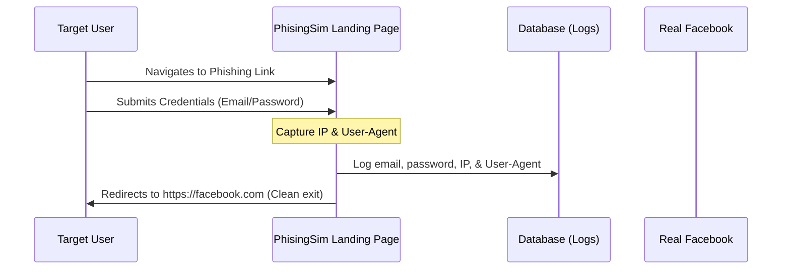

# PhisingSim 🎣

[](LICENSE)
[](https://www.php.net/)
[](https://laravel.com)

**PhisingSim** is a lightweight, self-hosted web application built on the Laravel framework. It is designed to run phishing simulation campaigns and track metrics to train users and employees on how to identify and avoid social engineering attacks.

> [!WARNING]
> **LEGAL DISCLAIMER**: This application is strictly for **authorized educational, training, and penetration testing simulations**. Running phishing campaigns without the explicit written permission of the target organization or individuals is illegal. The author assumes no responsibility or liability for any misuse, damage, or legal issues caused by this Software. Read the full [DISCLAIMER.md](DISCLAIMER.md) before deployment.

---

## 🚀 Features

- ✉️ **Campaign Manager**: Design and trigger customized phishing simulation emails containing targeted subjects, bodies, and simulation landing page links.
- 👤 **Realistic Login Simulation**: Contains realistic mock landing pages (such as Facebook) designed to test if users input credentials.
- 📊 **Real-time Analytics Dashboard**: Monitor campaign success rates in real-time, including:
  - Total emails sent vs. links clicked.
  - Mock credentials captured (email/password).
  - Target meta-data (IP addresses, User-Agent strings, and timestamps).

---

## 🛠️ Tech Stack

- **Backend**: PHP >= 8.1, Laravel 11.x
- **Frontend**: Blade Templating, Vanilla CSS, Tailwind CSS / Bootstrap
- **Database**: MySQL, PostgreSQL, or SQLite

---

## ⚙️ Getting Started & Installation

### Prerequisites

Ensure you have the following installed on your machine:
- PHP >= 8.1
- Composer
- Node.js & NPM
- Database server (MySQL / MariaDB or SQLite)

---

### Step-by-Step Setup

#### 1. Clone the Repository
```bash
git clone https://github.com/your-username/PhisingSim.git
cd PhisingSim
```

#### 2. Install PHP Dependencies
```bash
composer install
```

#### 3. Install Frontend Dependencies
```bash
npm install
```

#### 4. Configure Environment
Copy the example environment file and generate the application encryption key:
```bash
cp .env.example .env
php artisan key:generate
```

Open `.env` in a text editor and configure your database settings:
```ini
DB_CONNECTION=mysql
DB_HOST=127.0.0.1
DB_PORT=3306
DB_DATABASE=phising_sim
DB_USERNAME=root
DB_PASSWORD=
```

#### 5. Run Database Migrations
Create the database tables for logging and campaign details:
```bash
php artisan migrate
```

#### 6. Build Assets & Start Server
Compile frontend assets:
```bash
npm run dev
```

In a separate terminal, launch the local PHP development server:
```bash
php artisan serve
```

Access the application in your browser at `http://127.0.0.1:8000`.

---

## 📁 Project Architecture & Flow

The key components of the simulator are structured as follows:

- **Campaign Management**: Managed by `CampaignController.php` at [`app/Http/Controllers/CampaignController.php`](app/Http/Controllers/CampaignController.php).
- **Simulation Actions**: Simulated pages and credentials interception are handled by `PhishingController.php` at [`app/Http/Controllers/PhishingController.php`](app/Http/Controllers/PhishingController.php).
- **Dashboard / Reporting**: Real-time stats are fetched and rendered by `DashboardController.php` at [`app/Http/Controllers/DashboardController.php`](app/Http/Controllers/DashboardController.php).
- **Views**:
  - Facebook Simulation Page: [`resources/views/phishing/facebook.blade.php`](resources/views/phishing/facebook.blade.php)
  - Analytics Dashboard: [`resources/views/phishing/dashboard.blade.php`](resources/views/phishing/dashboard.blade.php)

### Interception Flow



---

## 🛡️ Security

If you discover any security issues with the PhisingSim framework itself, please review our [SECURITY.md](SECURITY.md) guidelines for instructions on responsible disclosure.

---

## 🤝 Contributing

We welcome community feedback and suggestions to make this simulator a better training tool. Please read our [CONTRIBUTING.md](CONTRIBUTING.md) for details on code style, testing, and contribution protocols.

---

## 📄 License

This project is licensed under the MIT License. See the [LICENSE](LICENSE) file for details.
